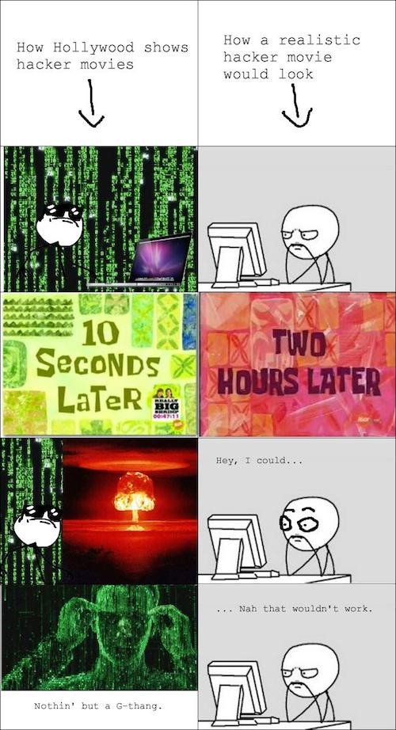
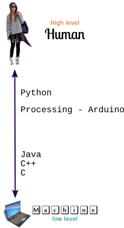

# Tecnologías Creativas en el Aula - Processing

## Introducción

### ¿Por qué programar?

Si alguna vez te has preguntado cómo es que tu celular logra aplicar filtros automáticos para hacerte ver genial en tus selfies, o cómo es que tu smart tv logra entender tus comandos de voz, o has querido simplificar el encendido de luces de tu cuarto para no tener que levantarte de la cama para apagar las luces... todas estas preguntas son la respuesta a ***¿por qué programar?***. Sea que te guste la tecnología o no, sea que prefieres las artes a las ciencias o la literatura a la ingeniería, por motivos prácticos o políticos, todos sin ninguna distinción deberíamos saber programar ya que *"Todos sabemos cómo será el futuro pero casi nadie se pregunta cómo haremos realidad ese futuro"* [**David Cuartielles**][1].

Tanto como si lo único que te interesa es ser un simple ciudadano más del mundo, aprender a programar va a contribuir para mejorar tus capacidades de razonamiento lógico, estructurado y ordenado, también se desarrollará tu intuición, serás más crítico y evaluarás más rápidamente posibles errores  presentes en tus razonamientos y en los razonamientos de tus interlocutores.

Programar no es una tarea que deba aprender únicamente quien tenga interés en la tecnología o las ciencias es un deber de todo ciudadano crítico y consiente de su sociedad. Saber programar te enseñará también cuál es la diferencia entre ser un usuario de la tecnología y dejarse usar por la tecnología.

### Pero ¿qué es programar?

Programar no necesariamente tiene que ver con escribir [código][4] en algún lenguaje en particular, programar tiene más que ver con desarrollar un [algoritmo][2] que sirva para ejecutar cualquier tarea de forma eficiente. Piensa y responde:

1. ¿Cuál es el procedimiento que sigues cada vez que te lavas los dientes?
2. Ahora detalla en una lista cada uno de los pasos que debes seguir, entre más detallada sea tu lista mejor.
3. ¿Alguno de los pasos que listaste en el numeral anterior es redundante o puede eliminarse de la lista sin perdida de calidad en el resultado final (tener los dientes limpios)?

Lo que has hecho es
1. Determinar un problema
2. Establecer un algoritmo de solución
3. Depurar tu algoritmo
por lo tanto lo que has hecho es **programar** tu cerebro para que ejecute los pasos necesarios para que tengas los dientes limpios.

Si desarrollaste el ejercicio anterior estas ahora en capacidad de comprender que programar no tiene que ver con desarrollar código e incluso no tiene que ver con la tecnología, tiene que ver con **pensar**. Aparentemente siempre pensamos, pero eso no es muy cierto, por lo general dejamos que sea nuestro cerebro el que tome decisiones que se ejecutan completamente en [segundo plano][3] y de las cuales no somos conscientes. Programar es hacerse consciente de un problema y los pasos necesarios para resolverlo eficientemente y esto exige una alta disposición para pensar de manera muy estructurada.

Programar no es una tarea fácil, es una tarea exigente que pondrá en jaque tu tolerancia al fracaso pero descubrirás que la satisfacción de conseguir la solución de un problema es más grande que cualquier sobresalto del camino, aprenderás que el esfuerzo, la dedicación y disciplina son la única vía al éxito - el camino fácil solo te conduce a la mediocridad -.

### ¿Qué es un lenguaje de programación?

Un lenguaje de programación es un medio que se utiliza para construir las órdenes que debe ejecutar una máquina. Las máquinas no son inteligentes, solo tienen capacidad de procesamiento y almacenamiento por lo tanto es necesario saber darles las órdenes correctas en la secuencia correcta para que ejecuten la tarea que queramos. Un lenguaje de programación nos permite traducir nuestro lenguaje humano en un lenguaje que la máquina puede comprender.

Los lenguajes de programación se clasifican de acuerdo a la cercanía con el lenguaje propio de las máquinas (binario) en *lenguajes de bajo nivel* (los más próximos al binario) y *lenguajes de alto nivel* (los más próximos al lenguaje humano).

Dos conceptos fundamentales que debes aprender con absoluta claridad son

- **Sintaxis** es el orden lógico, la estructura del lenguaje de programación. Todo lenguaje tiene una sintaxis, un ejemplo simple: en español dices _"el auto color rojo"_ no _"el auto rojo color"_, el orden de las palabras determina su correcta _sintaxis_.
- **Semántica** es el significado de lo que dices o escribes, así puedes decir _"el resplandeciente corpúsculo de brillante amanecer sobresale bajo las olas de impregnante sonido"_ lo cual puede que se escuche - a lo más - "bonito" pero carece de todo significado. Un lenguaje de programación tiene semántica y si lo que escribes no tiene significado, la máquina no podrá ejecutarlo.

## Processing

[Processing][5] es un [lenguaje de programación][6] basado en [Java][7] orientado a artistas y diseñadores gráficos. Ha tenido un gran impacto en la educación como lenguaje de aprendizaje. Es [Software Libre][8] [multiplataforma][9] por tanto puede ser utilizado en GNU / Linux, MacOS o MS Windows sin diferencia. Desde [processing.org][10] puede descargarse el instalador para cualquiera de estos [sistemas operativos][11].

### ¿Qué aprenderé?

1. Datos: Todo con lo que trabaja un computador son datos
2. Variables (datos individuales)
3. Control: ¿Cómo controlar el flujo de datos en la máquina?
4. Condicionales
5. Bucles
6. Organización: Modularidad y reuso
7. Funciones
8. Objetos
9. Arreglos (paquetes de datos)

### Mecánica del curso

Avanzarás por una serie de lecciones que te introducirán en el mundillo de la programación con processing aprendiendo los conceptos generales que deberás dominar en cualquier lenguaje de programación. Encontrarás preguntas y ejercicios que deberás resolver antes de continuar para tener un aprendizaje satisfactorio.

Programar te exigirá utilizar tu cerebro al máximo y debes estar dispuesto a invertir tiempo y ser paciente para obtener los resultados deseados. Programar mejorará tus niveles de disciplina y tolerancia a la frustración, así es como te convertirás en un ciudadano del mundo - que la fuerza te acompañe.

### [Dirígete a la lección 1 - Dibujando con pixels][13]

En esta lección conocerás el IDE de processing y aprenderás a dibujar usando el sistema de coordenadas así como los diferentes modelos de color que puedes utilizar en processing. Aprovecha para darte una pasada por [la referencia de processing][15] y aprender cómo esta organizada la documentación. Saber leer la documentación es fundamental ya que te permitirá conocer el lenguaje con el que estás desarrollando y encontrar fácilmente las herramientas que estas buscando para tus sketch.

### [Dirígete a la lección 2 - Variables][17]

En este lección aprenderás acerca de la manipulación de variables ¿qué son? ¿cómo se crean? ¿qué tipos de variables existen? y también aprenderás a interactuar con tus sketch mediante el teclado y el mouse.

### [Dirígete a la lección 3 - Condicionales][18]
En esta lección aprenderás cómo hacer para que tus sketch tomen decisiones mediante el uso de declaraciones y operadores condicionales `if` y variables booleanas.

### [Dirígete a la lección 4 - bucles][20]

En esta lección aprenderás a hacer más eficiente tu código mediante el uso de bucles, ya no tendrás que escribir muchas veces la misma línea de código cambiando apenas algunos parámetros, con los bucles vas a reducir la cantidad de código que escribes así será más legible para otros, porque estará mejor organizado y optimizado.

### [Dirigete a la lección 5][21]

Ya te estas convirtiendo en un hábil desarrollador de código, ahora debes aprender cómo hacer aún más eficiente y organizado tu código, para eso en esta lección te introduciremos a la _ingeniería del software_ mediante cuatro conceptos fundamentales
1. Documentación
2. Parametrización
3. Modularidad
4. Reuso

No te asustes, que no se trata de que te conviertas en un ingeniero de software solo de que aprendas a hacer buen código.

### [Dirigete a la lección 6][24]

[Gottfrid Svartholm, Fredrik Neij y Peter Sunde][25] creadores de _The Pirate Bay_ dejann siempre clara su idea de que lo que la mayoria llama "_vida real_" (en referencia a diferenciar lo que sucede mientras estás en tu computador conectado a la red y lo que haces cuando estás lejos de tu pc) no es más que lo que ellos llaman _*la vida lejos del teclado*_ ya que la vida en la red o el pc es tan real como lejos de ello. La programación orientada a objetos (POO) es una oportunidad de ver cómo la manipucación del código nos puede llevar a definir objetos tal como los que encontramos en _la vida lejos del teclado_ (AFK).

En esta lección aprenderás a definir objetos para tus sketch y utilizarlos de forma eficiente.

### [Dirígete a la lección 7][26]

¿Cómo elegir uno entre una lista de colores? o ¿cómo controlar la cantidad de gotas de agua que hay en una lluvia? son preguntas que pueden desafiar nuestra percepción de eficiencia en la progamación de código ya que como hasta ahora has aprendido, deberías definir cada objeto que vas a incluir en tu sketch por separado. Los arreglos vienen a ser la solución para que tus sketch pasen de una simple llovisna a una torrencial tormenta con solo cambiar el número de objetos que quieres. En esta lección aprenderás qué son los arreglos (`array`) y cómo utilizarlos para mejorar la eficiencia y modularidad en tu código.

## Recursos bibliográgráficos

Adicional a los contenidos aquí presentados, puedes consultar los siguientes recursos que te ayudarán a complementar lo aprendido y desarrollar nuevas habilidades.

1. [Introducción a p5.js][27]
2. [Learning Processing: A Beginner guide tu programming images, animation and interaction][28] de Daniel Shiffman - [@shiffman][29]. Los contenidos de este curso son una adaptación al español del material desarrollado por @shiffman.

## @piratax007
*Fausto Mauricio Lagos Suárez* es licenciado en Matemáticas y Estadística de la Universidad Pedagógica y Tecnológica de Colombia, Magister en Ingeniería Computacional y Matemática por al Universitat Rovira i Virgili de Catalunya (España).

[1]: https://youtu.be/J3xmvmtBQ2I
[2]: https://es.wikipedia.org/wiki/Algoritmo
[3]: https://es.wikipedia.org/wiki/Background
[4]: https://es.wikipedia.org/wiki/C%C3%B3digo_fuente
[5]: https://processing.org/overview/
[6]: https://es.wikipedia.org/wiki/Lenguaje_de_programaci%C3%B3n
[7]: https://es.wikipedia.org/wiki/Java_(lenguaje_de_programaci%C3%B3n)
[8]: https://es.wikipedia.org/wiki/Software_libre
[9]: https://es.wikipedia.org/wiki/Multiplataforma
[10]: https://processing.org/download/
[11]: https://es.wikipedia.org/wiki/Sistema_operativo
[12]: http://avatarmaker.com/
[13]: https://nbviewer.jupyter.org/github/piratax007/processing_course/blob/master/Leccion_1.ipynb
[14]: https://es.wikipedia.org/wiki/Teorema_de_los_cuatro_colores
[15]: https://processing.org/reference/
[16]: https://www.geogebra.org/m/NQnmR3CK
[17]: https://nbviewer.jupyter.org/github/piratax007/processing_course/blob/master/Leccion_2.ipynb
[18]: https://nbviewer.jupyter.org/github/piratax007/processing_course/blob/6a826970b8edf1cbf0731a6ddfe12c28e0c59785/Leccion_3.ipynb
[19]: https://github.com/piratax007/processing_course/blob/master/Ejemplos/demo_juego_1.mkv?raw=true
[20]: https://nbviewer.jupyter.org/github/piratax007/processing_course/blob/f9fe3adf1b1dc35c54c5295b344800fb152ea89c/Leccion_4.ipynb
[21]: http://nbviewer.jupyter.org/github/piratax007/processing_course/blob/2ba045e65743e38170c6c36f4993ac4eb0b059dc/Leccion_5.ipynb
[22]: https://github.com/piratax007/processing_course/blob/master/Ejemplos/rebota/rebota.pde
[23]: https://en.wikipedia.org/wiki/Richard_Stallman
[24]: http://nbviewer.jupyter.org/github/piratax007/processing_course/blob/040e4a17285acb15644b7530f0278f4c2a416e89/Leccion_6.ipynb
[25]: https://en.wikipedia.org/wiki/The_Pirate_Bay
[26]: http://nbviewer.jupyter.org/github/piratax007/processing_course/blob/040e4a17285acb15644b7530f0278f4c2a416e89/Leccion_7.ipynb
[27]: https://processingfoundation.press/es/
[28]: https://www.youtube.com/user/shiffman/playlists?sort=dd&view=50&shelf_id=2
[29]: https://twitter.com/shiffman
