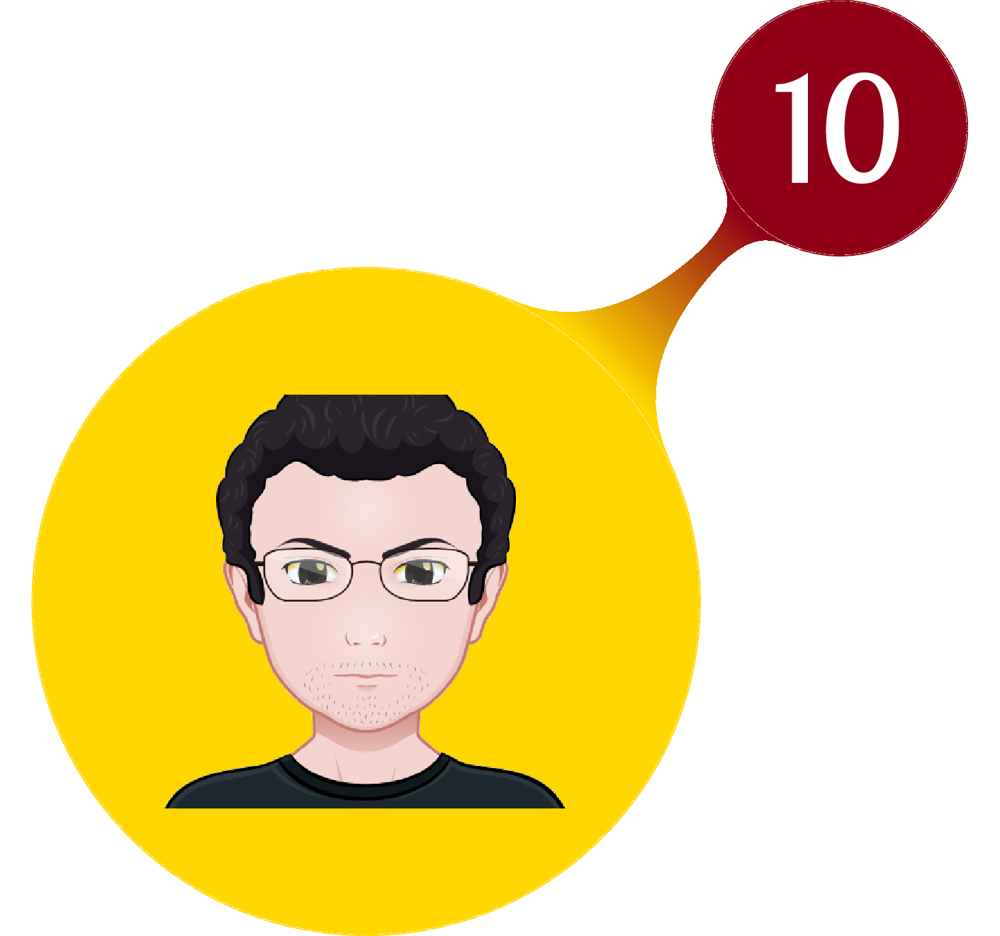
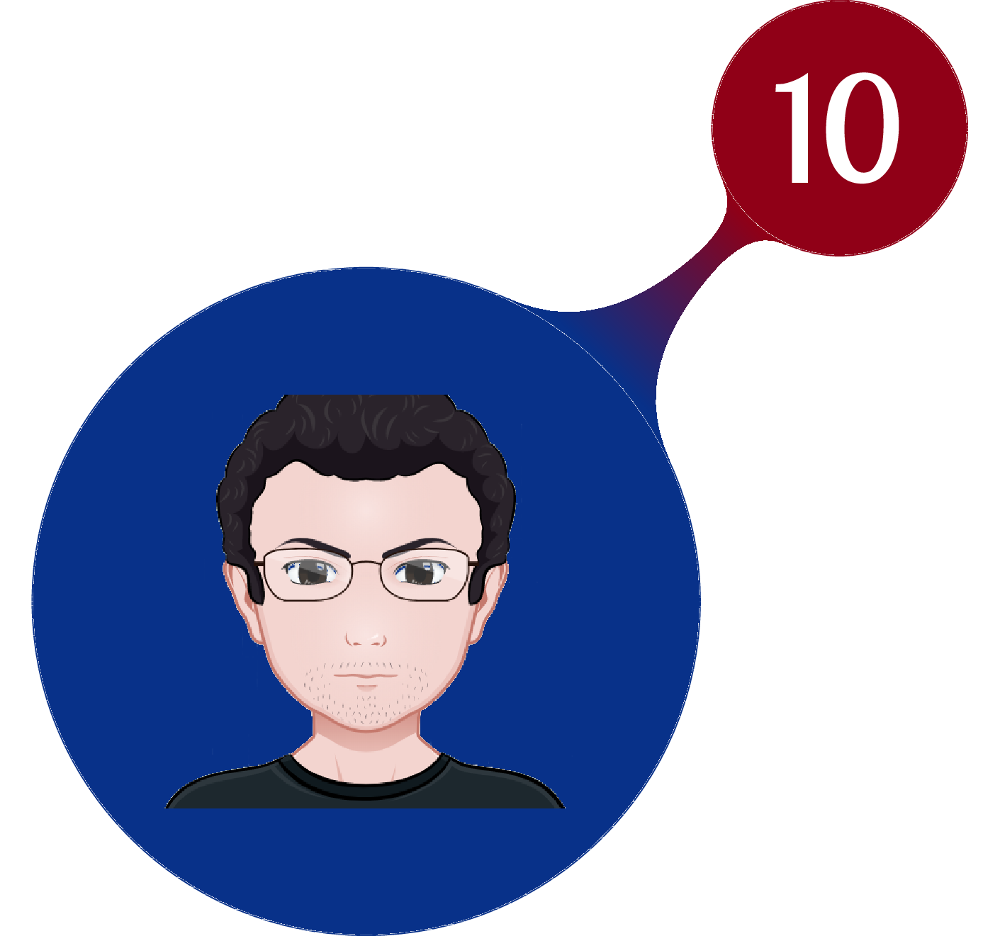
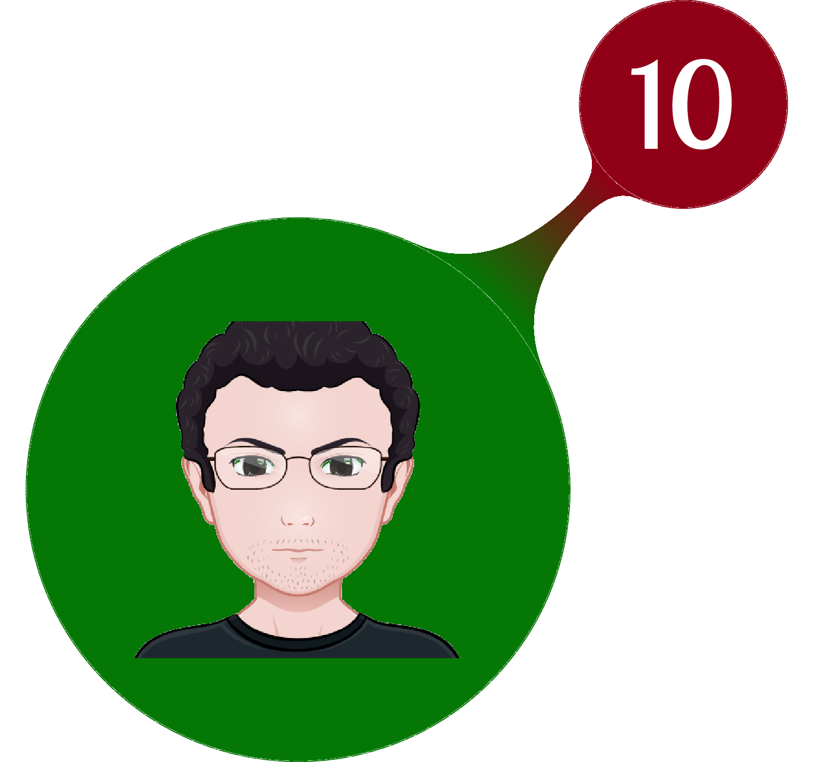
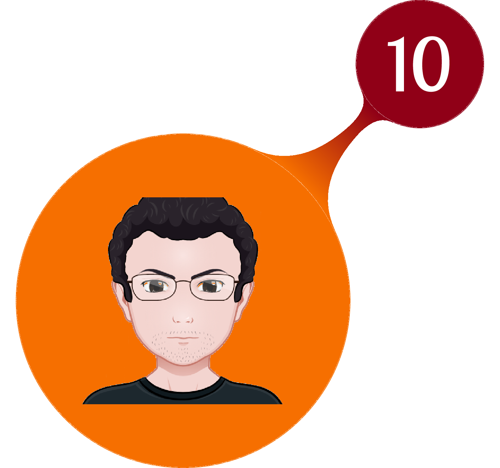
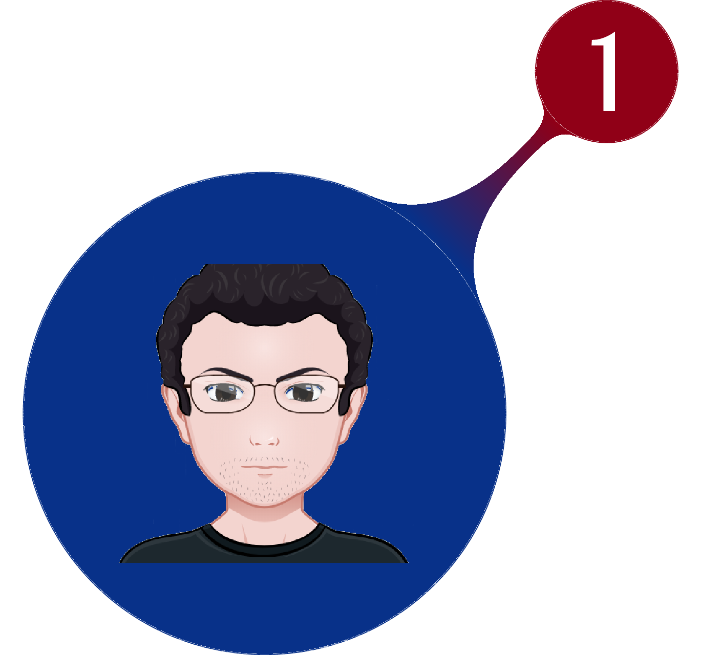
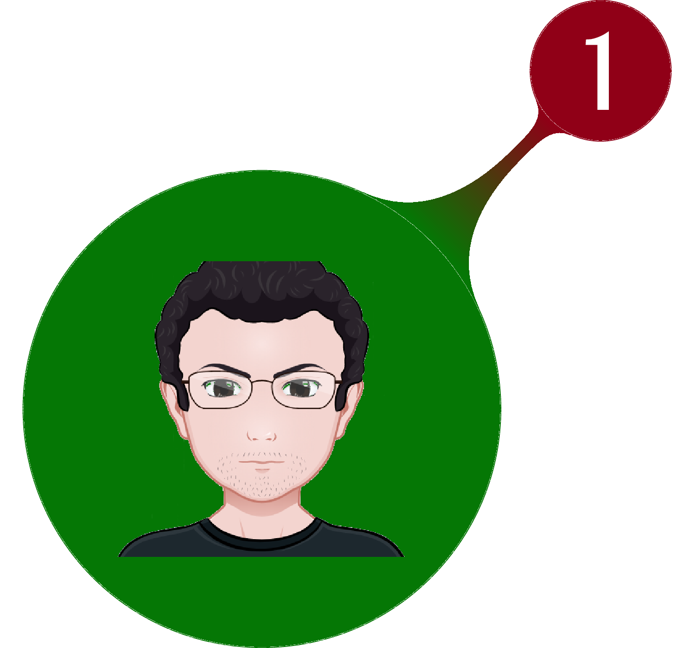
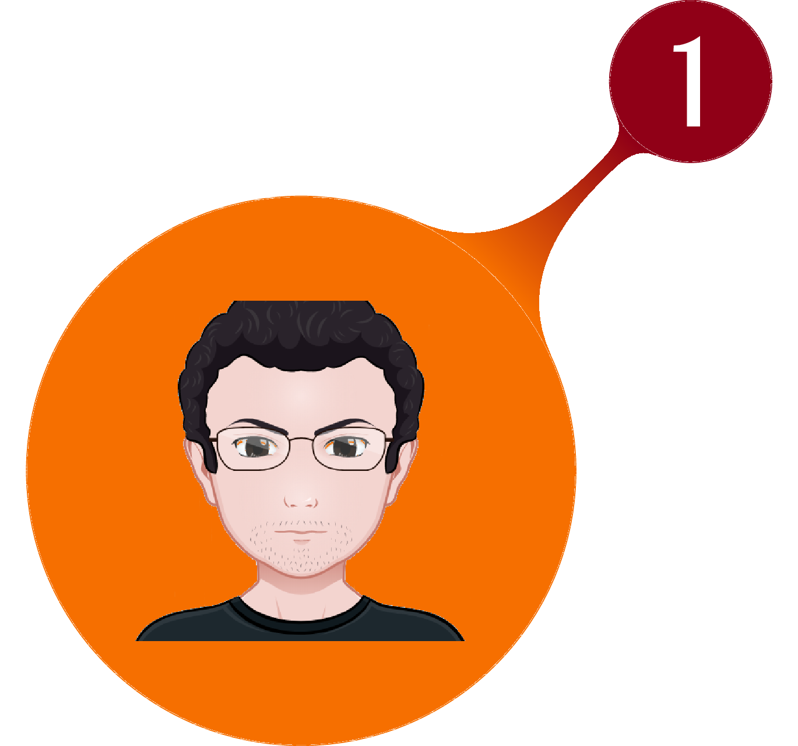
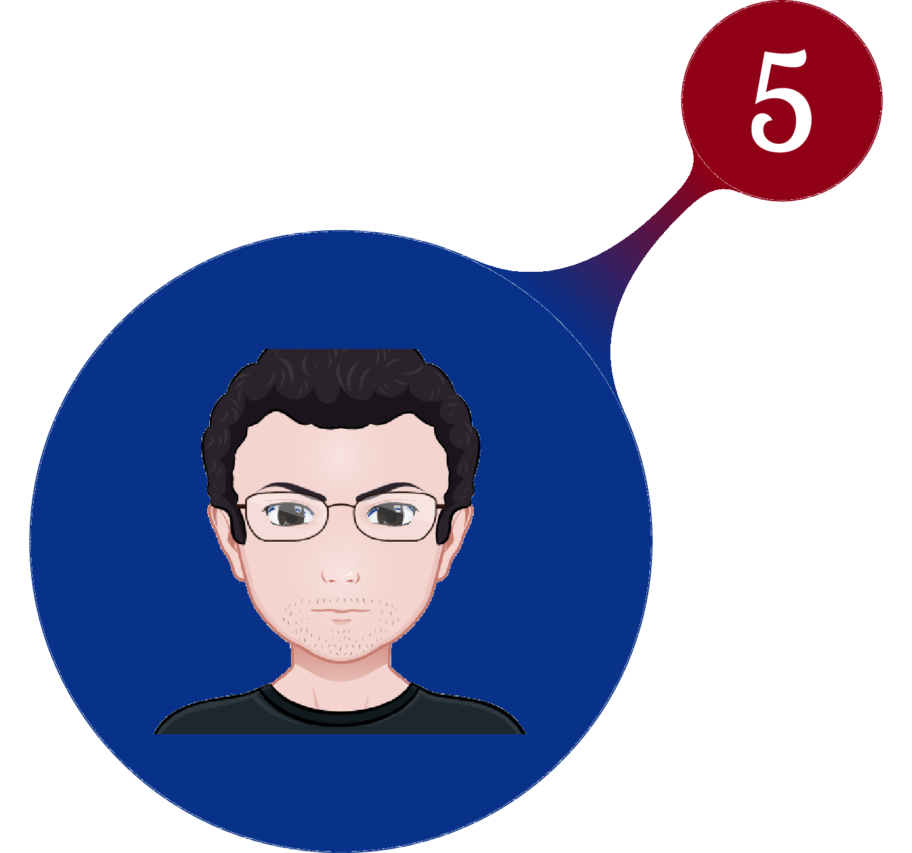
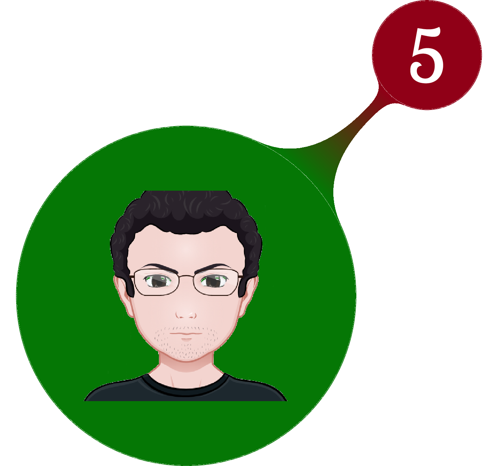
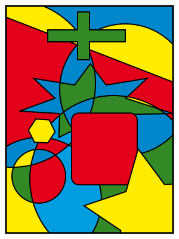

# Tecnologías Creativas en el Aula - Processing

## Introducción

### ¿Por qué programar?

Tal vez alguna vez has utilizado un computador, o tal vez un *smart phone* o cualquier dispositivo tecnológico, si es así entonces habrás utilizado los resultados del trabajo de algún hacker que programó dicha tecnología. Si te gusta la tecnología entenderás por qué debes aprender a programar ya que si y solo si sabes programar podrás participar en el desarrollo de la tecnología que construye el futuro - *"Todos sabemos cómo será el futuro pero casi nadie se pregunta cómo haremos realidad ese futuro"* [**David Cuartielles**][1]. Y si no estas pensando en ser ingeniero, científico o hacker ¿por qué deberías aprender a programar? la respuesta es simple pero no fácil - aprender a programar va a contribuir para que tu cerebro desarrolle nuevos circuitos sinápticos que mejorarán tus capacidades de razonamiento lógico, estructurado y ordenado, también se desarrollará tu intuición, serás más crítico y evaluarás más rápidamente los errores que presentes en tus razonamientos y en los razonamientos de tus interlocutores. Programar no es una tarea que deba aprender únicamente quien tenga interés en la tecnología o las ciencias es un deber de todo ciudadano crítico y conciente de su sociedad. Aprenderás también cuál es la diferencia entre ser un usuario de la tecnología y dejarse usar por ésta.

### Pero ¿qué es programar?

Programar no necesariamente tiene que ver con escribir [código][4]  en algún lenguaje en particular, programar tiene más que ver con desarrollar un [algoritmo][2] que sirva para ejecutar cualquier tarea de forma eficiente. Piensa y responde

1. ¿Cuál es el procedimiento que sigues cada vez que te lavas los dientes?
2. Ahora detalla en una lista cada uno de los pasos que debes seguir, entre más detallada sea tu lista mejor.
3. ¿Alguno de los pasos que listaste en el numeral anterior es redundante o puede eliminarse de la lista sin perdida de calidad en el resultado final (tener los dientes límpios)?

Lo que has hecho es
1. Determinar un problema
2. Establecer un algoritmo de solución
3. Depurar tu algoritmo
por lo tanto lo que has hecho es **programar** tu cerebro para que ejecute los pasos necesarios para que tengas los dientes límpios.

Si desarrollaste el ejercicio anterior estas ahora en capacidad de comprender que programar no tiene que ver con desarrollar código e incluso no tiene que ver con la tecnología, tiene que ver con **pensar**. Aparentemente siempre pensamos, pero eso no es muy cierto, por lo general dejamos que sea nuestro cerebro quien tome decisiones que se ejecutan completamente en [segundo plano][3] y de las cuales no somos concientes. Programar es hacerse conciente de un problema y los pasos necesarios para resolverlo eficientemente y esto exige una alta disposición para pensar de manera muy estructurada.

Programar no es una tarea fácil, es una tarea exigente que pondrá un jaque tu tolerancia al fracaso pero descubrirás que la satisfacción de conseguir la solución de un problema es más grande que cualquier sacrificio hecho para encontrarla, aprenderás que el esfuerzo, la dedicación y disciplina son los pasos que debes dar para conseguir el éxito y son los escudos que te defienden de la mediocridad.

### ¿Qué es un lenguaje de programación?

Un lenguaje de programación es un medio que se utiliza para construir las órdenes que debe ejecutar una máquina. Las máquinas no son inteligentes, solo tienen capacidad de procesamiento y almacenamiento por lo tanto es necesario saber darles las órdenes correctas en la secuencia correcta para que ejecuten la tarea que queramos. Un lenguaje de programación nos permite traducir nuestro lenguaje humano en un lenguaje que la máquina puede comprender.

Los lenguajes de programación se clasifican de acuerdo a la cercanía con el lenguaje propio de las máquinas (binario) en *lenguajes de bajo nivel* (los más próximos al binario) y *lenguajes de alto nivel* (los más próximos al lenguaje humano).

## Processing

[Processing][5] es un [lenguaje de programación][6] basado en [Java][7] orientado a artístas y diseñadores gráficos. Ha tenido un gran impacto en la educación como lenguaje de aprendizaje. Es [Software Libre][8] [multiplataforma][9] por tanto puede ser utilizado en GNU / Linux, MACOS o MS Windows sin diferencia. Desde [processing.org][10] puede descargarse el instalador para cualquiera de estos [sistemas operativos][11].

### ¿Qué aprenderé?

1. Datos: Todo con lo que trabaja un computador son datos
  1. Variables (datos individuales)
  2. Arreglos (paquetes de datos)
2. Control: ¿Cómo controlar el flujo de datos en la máquina?
  1. Condicionales
  2. Bucles
3. Organización: Modularidad y reuso
  1. Funciones
  2. Objetos

### Mecánica de juego

A medida que transcurran las lecciones encontrarás nuevos retos que pondrán en juego diferentes habilidades que debes desarrollar solo o trabajando en equipo - recuerda que programar no solo se trata de escribir código. Verás cómo mientras aprendes a programar te convertirás en
- _HACKER_ : Un maestro del desarrollo de código.
- _PIONEER_ : La mente más creativa e innovadora.
- _ACHIEVER_ : Aceptarás cualquier reto con tal de conseguir el mayor puntaje.
- _HERO_ : El más noble ser humano que no permitirá que nadie se quede atrás.

Podrás concentrarte en alcanzar el máximo nivel en uno de estos roles o desarrollar habilidades de todos que te hagan un programador con capacidad de ocupar cualquier roll que sea necesario. El juego se desarrollará en cuatro etapas, para superar cada etapa deberás alcanzar mínimo 60 puntos que acumularas ganando medallas de cualquiera de los roles.

#### MISIÓN AVATAR

Utilizando una herramienta como [avatarmaker][12] desarrolla tu propio avatar con fondo transparente. Recibirás estas tres medallas personalizadas.

### [Dirígete a la lección 1 - Dibujando con pixels][13]

En esta lección aprenderás conocerás la interface de trabajo de processing y aprenderás a dibujar usando el sistema de coordenadas así como los diferentes modelos de color que puedes utilizar en processing.

#### MISIÓN MARTIN GARDNER

Lee atentemante [este artículo][14] sobre el teorema de los cuatro colores.

Resolverás el [mapa de Martin Gardner][16] y le mostrarás a tus compañeros tu solución después crearás en processing el mapa más complejo que se te ocurra, el tamaño lo decides tu así como el número de regiones que utilizarás y la fórma de estas regiones.

Recibirás 10 puntos _HACKER_ desarrollando esta misión.

Recibirás 5 puntos _PIONEER_ y 5 puntos _ACHIEVER_ si utilizas las funciones [`vertex`][15] para diseñar tu mapa.

Este es un ejemplo de lo que puedes hacer con estas Funciones

Recibirás 1 punto _HERO_ por cada compañero a quien ayudes y lo certifique. Ten en cuenta que estos puntos serán descontados a tus compañeros.

Tus compañeros evaluarán la complejidad de tu mapa, el mapa que reciba más puntos (el más complejo) recibirá el mismo número de puntos _HACKER_.

Tus compañeros votarán por cuál es el mapa más creativo, el mapa que reciba más puntos (el más creativo) recibirá el mismo número de puntos _PIONEER_.

### [Dirígete a la lección 2 - Variables][17]

En este lección aprenderás hacerca de la manipulación de variables ¿qué son? ¿cómo se crean? ¿qué tipos de variables existen? y también aprenderás a interactuar con tus sketch mediante el teclado y el mouse. Al final de la lección encontrarás un ejercicio con tres preguntas que debes responder para evaluar tu aprendizaje.

### [Dirígete a la lección 3 - Condicionales][18]
En esta lección aprenderás cómo hacer para que tus sketch tomen decisiones mediante el uso de declaraciones y operadores condicionales `if` y variables booleanas.

#### Misión Rebota
Tu misión será desarrollar tu primer juego. En este juego una esfera empezará a moverse en una dirección aleatoria por el tablero y cada vez que toque alguno de los bordes del lienzo el `Background` cambiará a color rojo, la finalidad del juego será no permitir que la elipse toque los bordes del lienzo para lo cual el jugador tendrá que dar click dentro de la elipse para que esta cambie la dirección del movimiento de forma aleatoria y a una velocidad aleatoria también.

En [este vídeo][19] puede ver una demostración de cómo debe funcionar tu juego.

Recuerda que no es necesario correr en busca de ayuda, lo que has aprendido hasta ahora es más que suficiente para que tengas éxito en esta misión, sin embargo, si necesitas ayuda, recuerda que tienes a tu profesor y a tus compañeros en los foros de discusión del aula para que puedas preguntarles todo lo que necesites.

Al desarrollar esta misión conseguirás 30 puntos Hacker.
3x

[1]: https://youtu.be/J3xmvmtBQ2I
[2]: https://es.wikipedia.org/wiki/Algoritmo
[3]: https://es.wikipedia.org/wiki/Background
[4]: https://es.wikipedia.org/wiki/C%C3%B3digo_fuente
[5]: https://processing.org/overview/
[6]: https://es.wikipedia.org/wiki/Lenguaje_de_programaci%C3%B3n
[7]: https://es.wikipedia.org/wiki/Java_(lenguaje_de_programaci%C3%B3n)
[8]: https://es.wikipedia.org/wiki/Software_libre
[9]: https://es.wikipedia.org/wiki/Multiplataforma
[10]: https://processing.org/download/
[11]: https://es.wikipedia.org/wiki/Sistema_operativo
[12]: http://avatarmaker.com/
[13]: http://nbviewer.jupyter.org/github/piratax007/processing_course/blob/0fac0d6e695c329407f20267b7e0c131727983f1/Leccion_1.ipynb
[14]: https://es.wikipedia.org/wiki/Teorema_de_los_cuatro_colores
[15]: https://processing.org/reference/
[16]: https://www.geogebra.org/m/NQnmR3CK
[17]: http://nbviewer.jupyter.org/github/piratax007/processing_course/blob/452057650f59b9076036dd4795ad724361c39961/Leccion_2.ipynb
[18]: http://nbviewer.jupyter.org/github/piratax007/processing_course/blob/969a5caab4890da58326819c36d3e99862147d1a/Leccion_3.ipynb
[19]: https://github.com/piratax007/processing_course/blob/master/Ejemplos/demo_juego_1.mkv?raw=true
